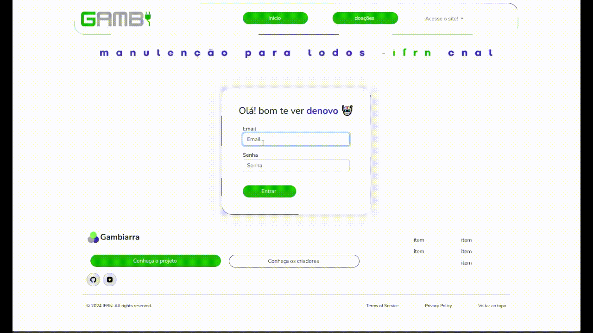
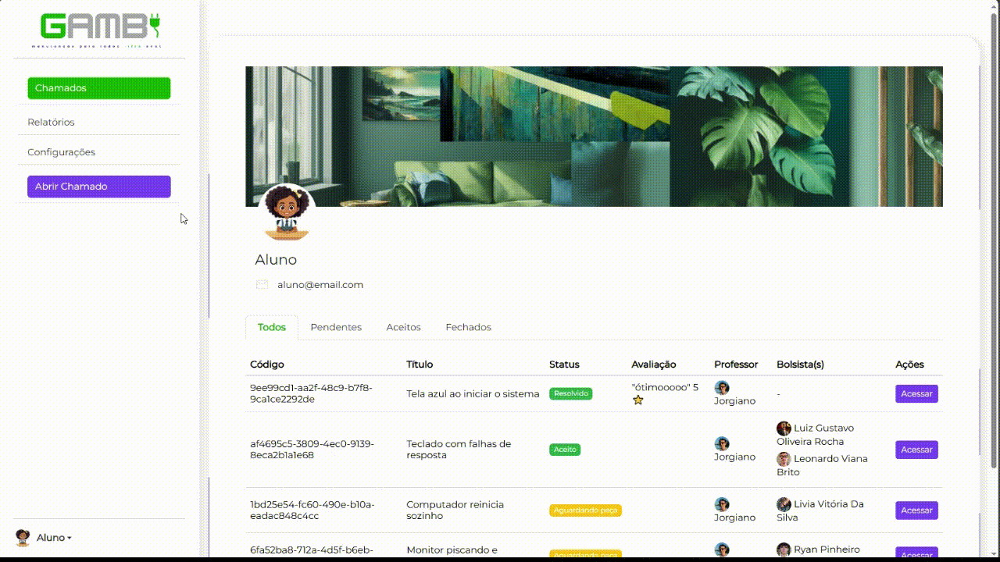
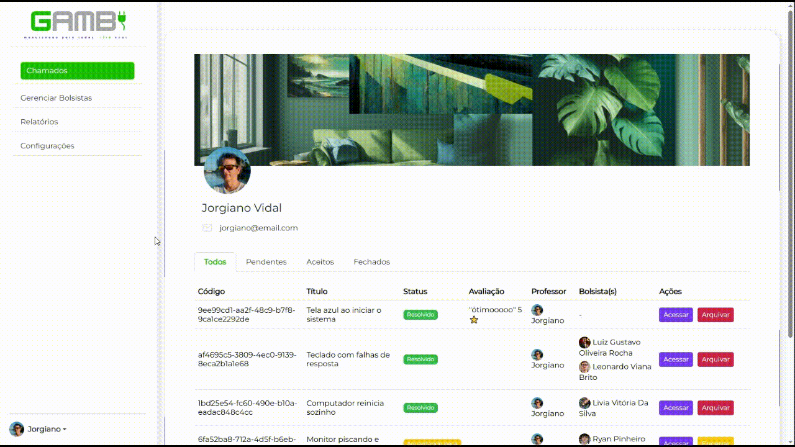
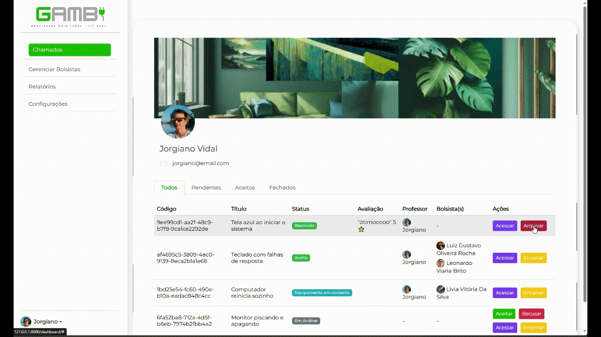
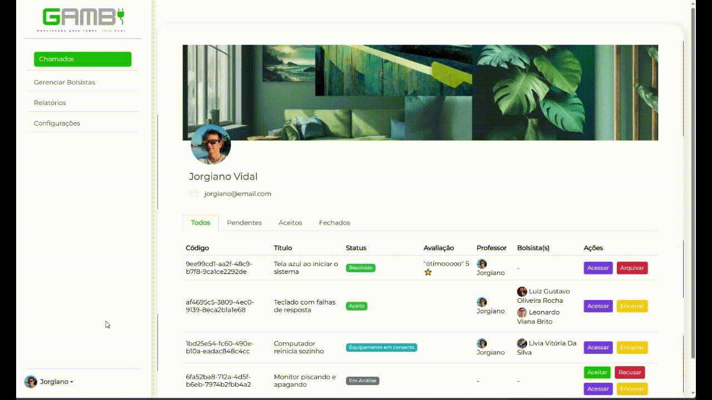
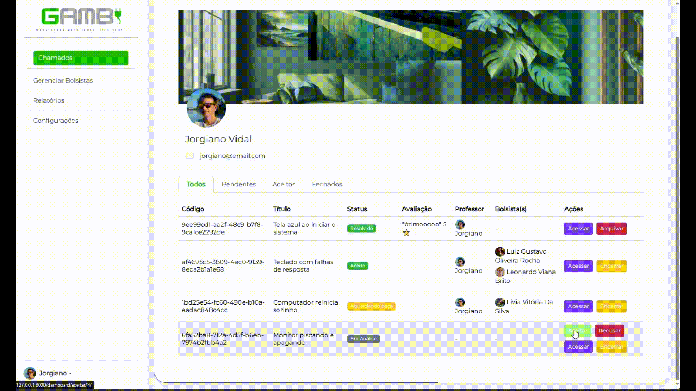
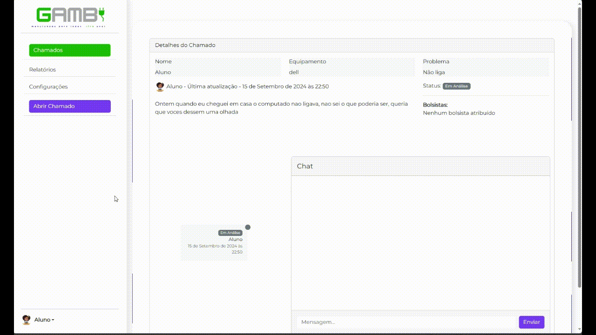
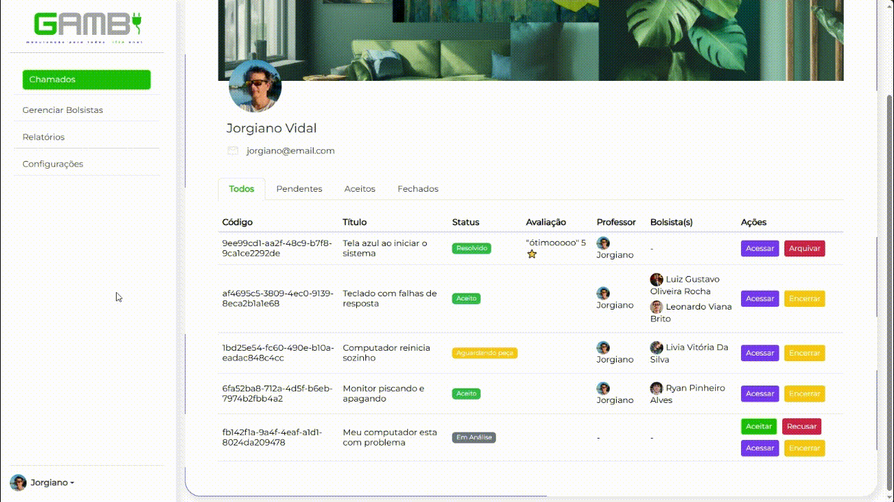

# Gambiarra

O propósito do Projeto Gambiarra é estabelecer uma conexão entre estudantes em manutenção de computadores e membros, tanto alunos quanto servidores, da comunidade IFRN-CNAT que necessitam desses serviços. Dessa forma, busca-se oferecer uma oportunidade de prática profissional aos estudantes em forma de extensão sob a orientação atenta de um professor.

## Equipe e Formas de Contato

| Integrante| Github| Discord |
| ------------- | ------------- | ------------- |
| Leonardo Viana  | [leveau10](https://github.com/leveau10)  | leveau10 |
| Lívia Vitória | [Naninh4](https://github.com/Naninh4)  | amy_5he |
| Luiz Gustavo | [1Lgr](https://github.com/1Lgr)   | 1lgr |
| Ryan Pinheiro | [ryan-pin](https://github.com/ryan-pin)   | santuaryum |

## Horário de Reuniões
| Dia| Horário| Local |
| ------------- | ------------- | ------------- |
|  Segunda-feira | 20:00  | Discord |
|  Quarta-feira | 9:00 | IFRN |
|  Domingo | 20:00  | Discord |

## Gerente: prof. Fellipe Aleixo

Ordem para contato com o gerente da equipe:
1. Comentários das ISSUES no GitHub, mencionando @fellipealeixo;
1. Chat do Teams - canal da equipe ou contato direto;
1. Discord: fellipealeixo;
1. E-mail: fellipe.aleixo@ifrn.edu.br

# Documentação

[Link para os documentos do projeto](doc/documentacao.md)

## Manual da Desenvolvedor

[Orientações para os desenvolvedores do projeto](doc/guia-ds/guia.md)

## Telas do site

### 1. Login

### 2. Abrir chamado - Aluno

### 3. Aceitar chamado - Professor

### 4. Encerrar chamado - Professor

### 5. Avaliar chamado - Aluno

### 6. Listar chamados

### 7. Gerenciar bolsista

### 8. Atribuir bolsista

### 9. Detalhar Chamado e enviar mensagem

### 10. Alterar status do chamado - Professor

## Guia de contribuição ao projeto
---

### Como devo nomear minha issue? 🤔
---
##### 1° Passo:
| Deve usar uma linguagem objetiva e clara das atividades a serem realizadas naquela tarefa. 

##### 2° Passo:

| Faça o uso da linguagem `imperativa`:

_Exemplos_: 
``"Corrigir erro na validação do formulário de login"``

``"Adicionar opção de filtro por data na listagem de pedidos"``

``"Remover opções duplicadas no menu de configuração"``

### Como devo nomear minha branch? 🤔

`N° da issue seguida do seu nome`
exemplo:

    1-minha-primeira-issuo

### Como devo nomear meu commit? 🤔

`#Antesdetudo` A regra é simples: 
- "Release early, release often!"
- Commitar cedo, commitar como frequência.

---

O seu commit vai mudar de acordo com o propósito das mudanças aplicadas, como via de regra deve respeitar esse formato:

~~~markdown
"<emoji-da-tag> <tag>: O que esse commit faz?. #<numero-da-issue>"
~~~
 

Segue exemplos

1. **`:recycle:` ♻️ `refac:`** _Refatoração de código. Não há adição de novas funcionalidades nem correções de bugs. Apenas melhorias na estrutura, organização, ou legibilidade do código._  
   _Exemplo:_ `♻️ refac: melhora a lógica de cálculo de desconto`

 

2. **`:heavy_plus_sign:` ➕ `feat:`** _Adição de um novo recurso ou funcionalidade ao projeto._  
   _Exemplo:_ `➕ feat: implementa o sistema de autenticação de usuário`

 

3. **`:books:` 📚 `docs:`** _Alterações relacionadas à documentação, como README, arquivos de ajuda, ou comentários no código._  
   _Exemplo:_ ` 📚 docs: adiciona instruções de configuração no README`

 

4. **`:bug:` 🐛 `fix:`** _Correção de um bug existente._  
   _Exemplo:_ `🐛 fix: corrige erro na validação de e-mail`

 

5. **`:art:` 🎨 `style:`** _Alterações relacionadas a formatação e estilo do código (espaços, vírgulas, indentação, etc.) que não afetam a lógica do sistema._  
   _Exemplo:_ `🎨 style: ajusta indentação no arquivo main.js`

 

6. **`:fire:` 🔥 `remove:`** _Remoção de código ou arquivos desnecessários._  
   _Exemplo:_ `🔥 remove: apaga componentes não utilizados`

 

7. **`:zap:` ⚡ `perf:`** _Melhorias de desempenho, focadas em otimizar a velocidade ou reduzir a utilização de recursos._  
   _Exemplo:_ `⚡ perf: otimiza a consulta ao banco de dados`

 

8. **`:truck:` 🚚 `move:`** _Mover ou renomear arquivos ou diretórios._  
   _Exemplo:_ `🚚 move: reorganiza os arquivos para nova estrutura de diretórios`

 

9. **`:wrench:` 🔧 `chore:`** _Tarefas de manutenção que não impactam o funcionamento ou funcionalidades, como atualização de dependências._  
   _Exemplo:_ `🔧 chore: atualiza versão do pacote lodash`

 

10. **`:test_tube:` 🧪 `test:`** _Adição ou modificação de testes de código._  
    _Exemplo:_ `🧪 test: adiciona testes unitários para módulo de autenticação`

 

11. **`:construction:` 🚧 `WIP:`** _Indica que o commit é de um trabalho em progresso (Work In Progress), e não é uma versão final._  
    _Exemplo:_ `🚧 WIP: desenvolve a nova página de perfil`