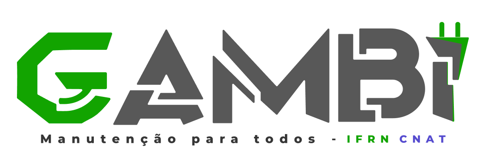

# Gambiarra

O propósito do Projeto Gambiarra é estabelecer uma conexão entre estudantes em manutenção de computadores e membros, tanto alunos quanto servidores, da comunidade IFRN-CNAT que necessitam desses serviços. Dessa forma, busca-se oferecer uma oportunidade de prática profissional aos estudantes em forma de extensão sob a orientação atenta de um professor.

## Equipe e Formas de Contato

| Integrante| Github| Discord |
| ------------- | ------------- | ------------- |
| Leonardo Viana  | [leveau10](https://github.com/leveau10)  | leveau10 |
| Lívia Vitória | [Naninh4](https://github.com/Naninh4)  | amy_5he |
| Luiz Gustavo | [1Lgr](https://github.com/1Lgr)   | 1lgr |
| Ryan Pinheiro | [ryan-pin](https://github.com/ryan-pin)   | santuaryum |

## Horário de Reuniões
| Dia| Horário| Local |
| ------------- | ------------- | ------------- |
|  Segunda-feira | 20:00  | Discord |
|  Quarta-feira | 9:00 | IFRN |
|  Domingo | 20:00  | Discord |

## Gerente: prof. Fellipe Aleixo

Ordem para contato com o gerente da equipe:
1. Comentários das ISSUES no GitHub, mencionando @fellipealeixo;
1. Chat do Teams - canal da equipe ou contato direto;
1. Discord: fellipealeixo;
1. E-mail: fellipe.aleixo@ifrn.edu.br

# Documentação

[Link para os documentos do projeto](gamb-doc/documentacao.md)

## Manual da Desenvolvedor

[Orientações para os desenvolvedores do projeto](gamb-doc/guia-ds/guia.md)

## Telas do site

### 1. Login

### 2. Abrir chamado - Aluno

### 3. Aceitar chamado - Professor

### 4. Encerrar chamado - Professor

### 5. Avaliar chamado - Aluno

### 6. Listar chamados

### 7. Gerenciar bolsista

### 8. Atribuir bolsista

### 9. Detalhar Chamado e enviar mensagem

### 10. Alterar status do chamado - Professor

