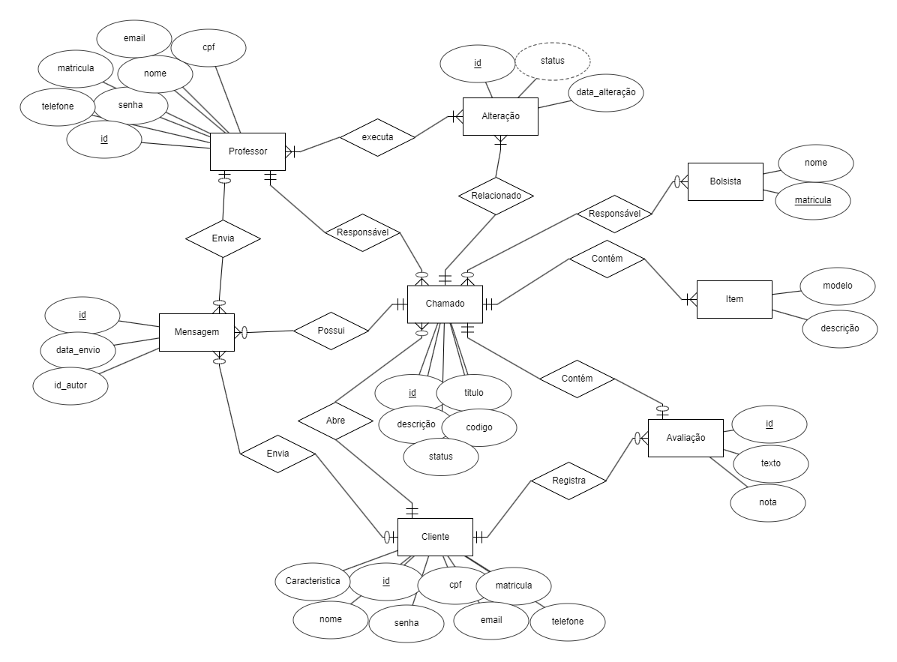

# Modelo de Dados

## Diagrama ER

2o esboço com atributos e relacionamentos iniciais

O sistema terá duas entidades que agem como atores principais: Cliente e Professor.
Ambos estarão relacionados à entidade chamado.
Um chamado pode conter uma avaliação registrada pelo cliente que a abriu.
Um chamado pode possuir várias mensagens enviadas pelos dois atores principais.
Um chamado pode conter vários equipamentos.
Um ou várioas alunos podem ser atribuídos à um chamado.

## Modelo Relacional

> Texto e imagem do Modelo Relacional...

## Dicionário de Dados

--- 
**Tabela** : [nome da tabela 1]

*Descrição* : ...

*Observações* : ...

| Colunas | Descrição | Tipo de Dado | Tamanho | Null | PK | FK | Unique | Identity | Default | Check | 
| ------- | --------- | ------------ | ------- | ---- | -- | -- | ------ | -------- | ------- | ----- |
| [nome da coluna] | [descrição da coluna] | [tipo_de_dado] | [tamanho - se necessário | &#9745;  | &#9744; | &#9744; | &#9744; | &#9744; | [default - se necessário] | [outras restrições - se necessário] | 

--- 
**Tabela** : [nome da tabela 2]

*Descrição* : ...

*Observações* : ...

| Colunas | Descrição | Tipo de Dado | Tamanho | Null | PK | FK | Unique | Identity | Default | Check | 
| ------- | --------- | ------------ | ------- | ---- | -- | -- | ------ | -------- | ------- | ----- |
| [nome da coluna] | [descrição da coluna] | [tipo_de_dado] | [tamanho - se necessário | &#9745;  | &#9744; | &#9744; | &#9744; | &#9744; | [default - se necessário] | [outras restrições - se necessário] | 
