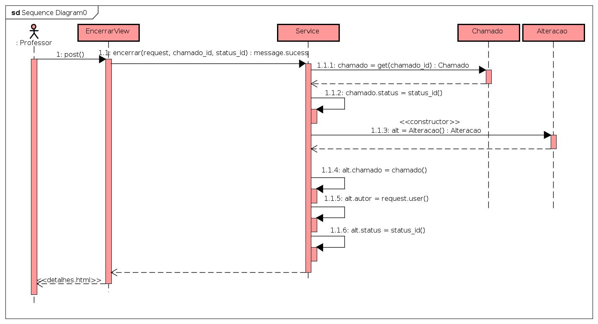

# CDU - Encerrar chamado

- **Ator principal**: Professor
- **Atores secundários**: ...	 
- **Resumo**: Neste caso de uso, o professor pode encerrar o chamado
- **Pré-condição**: Estar logado no sistema e estar na página de detalhes do chamado
- **Pós-Condição**: O sistema redireciona o professor para a tela de detalhes do chamado com o status indicando que está fechado

## Fluxo Principal
| Ações do ator | Ações do sistema |
| :-----------------: | :-----------------: | 
| 1 - O professor seleciona em "status" uma das opções de encerramento || |  
| | 2 -  O sistema abre uma modal de confirmação do encerramento do chamado |    
| 3 - O professor informa uma justificativa e clica no botão de encerrar o chamado | |  
| | 4 - O sistema redireciona o professor para a página de detalhes do chamado com o status atualizado | 

## Fluxo Alternativo I - Cancelar Encerramento
| Ações do ator | Ações do sistema |
| :-----------------: |:-----------------: | 
| 1.1 - O professor seleciona em "status" uma das opções de encerramento || |  
| | 1.2 - O sistema abre uma modal de confirmação do encerramento do chamado | 
| 1.3 - O professor clica no botão de cancelar a operação | |  
| | 1.4 - O sistema redireciona o professor para a página de detalhes do chamado | 

## Diagrama de Sequência - Encerrar Chamado

