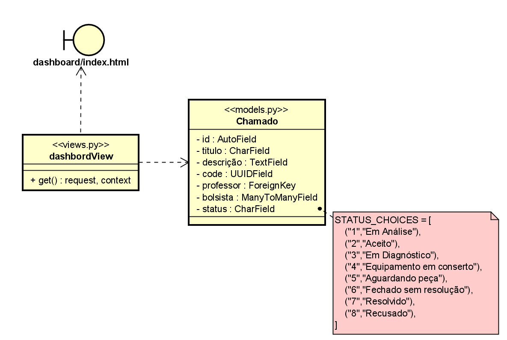

# CDU - Listar Chamados

- **Ator principal**: Professor
- **Atores secundários**: ...	 
- **Resumo**: Neste caso de uso, o professor pode listar chamados
- **Pré-condição**: Possuir uma conta
- **Pós-Condição**: O professor obtém todos chamados abertos

## Fluxo Principal
| Ações do ator | Ações do sistema |
| :-----------------: | :-----------------: |
| 1 - O professor realiza login no sistema || |  
| | 2 -  O sistema mostra a dashboard que já lista todos os chamados|    

## Fluxo Alternativo I - Listar chamados em análise
| Ações do ator | Ações do sistema |
| :-----------------: |:-----------------: | 
| 1.1 - O professor realize login no sistema || |  
| | 1.2 - O sistema mostra a dashboard que já lista todos os chamados | 
| 1.3 - O professor seleciona o filtro de chamados em análise | |  
| | 1.4 - O sistema mostra apenas os chamados em análise|

## Fluxo Alternativo II - Listar chamados aceitos
| Ações do ator | Ações do sistema |
| :-----------------: |:-----------------: | 
| 1.1 - O professor realize login no sistema || |  
| | 1.2 - O sistema mostra a dashboard que já lista todos os chamados | 
| 1.3 - O professor seleciona o filtro de chamados aceitos | |  
| | 1.4 - O sistema mostra apenas os chamados aceitos|

## Fluxo Alternativo III - Listar chamados fechados
| Ações do ator | Ações do sistema |
| :-----------------: |:-----------------: | 
| 1.1 - O professor realize login no sistema || |  
| | 1.2 - O sistema mostra a dashboard que já lista todos os chamados | 
| 1.3 - O professor seleciona o filtro de chamados fechados | |  
| | 1.4 - O sistema mostra apenas os chamados fechados|

## Diagrama de classe de projeto - Listar Chamado

