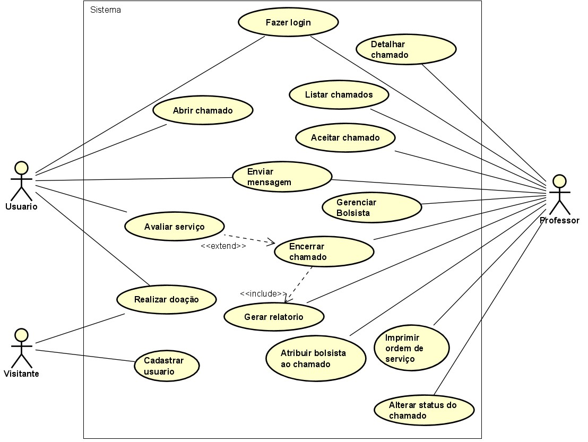

# Modelo de Casos de Uso

## 1. Diagrama de Caso de Uso

## 2. Listagem dos detalhamentos dos casos de uso

1. [CDU-001 - Login](cdu-001/cdu_login.md)
2. [CDU-002 - Abrir chamado](cdu-002/cdu_abrir_chamado.md)
3. [CDU-003 - Avaliar chamado](cdu-003/cdu_avaliar_chamado.md)
4. [CDU-004 - Aceitar chamado](cdu-004/cdu_aceitar_chamado.md)
5. [CDU-005 - Adicionar bolsista ao chamado](cdu-005/cdu_propor_doacao.md)
6. [CDU-006 - Encerrar chamado](cdu-006/cdu_encerrar_chamado.md)
7. [CDU-007 - Listar chamados](cdu-007/cdu_listar_chamado.md)