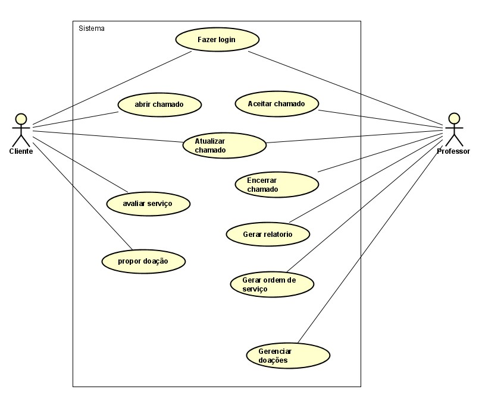

# Modelo de Casos de Uso

## 1. Diagrama de Caso de Uso

## 2. Listagem dos detalhamentos dos casos de uso

1. [CDU-001 - Login](cdu-001/cdu-login.md)
2. [CDU-002 - Abrir chamado](cdu-002/cdu_abrir_chamado.md)
3. [CDU-003 - Avaliar chamado](cdu-002/cdu_avaliar_chamado.md)
