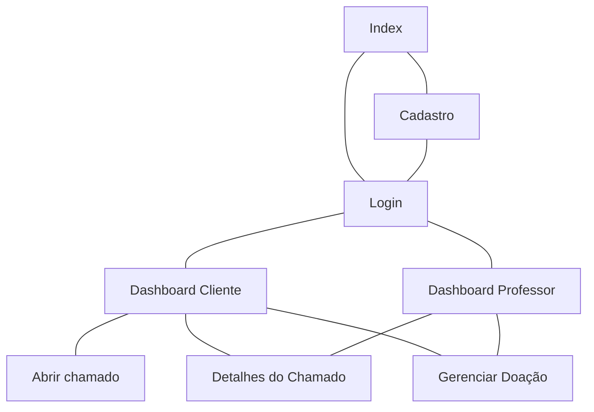

# Protótipos de Interface com o Usuário
## Mapa do Site
> Obs.: propõem-se a utilização de alguma ferramenta que possibilite a representação textual do diagrama. como o seguinte exemplo:

## Prototipos de baixa fidelidade

## A. Tela 1: Index

## B. Tela 2: Login

