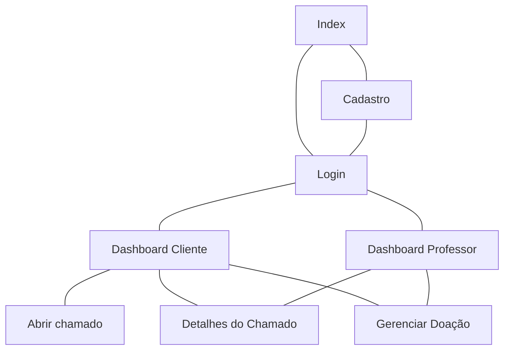
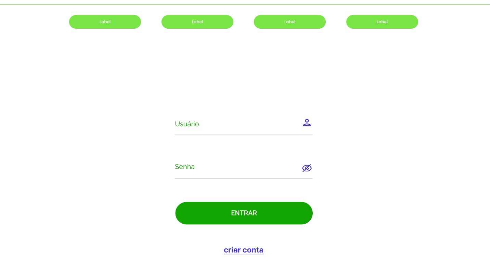
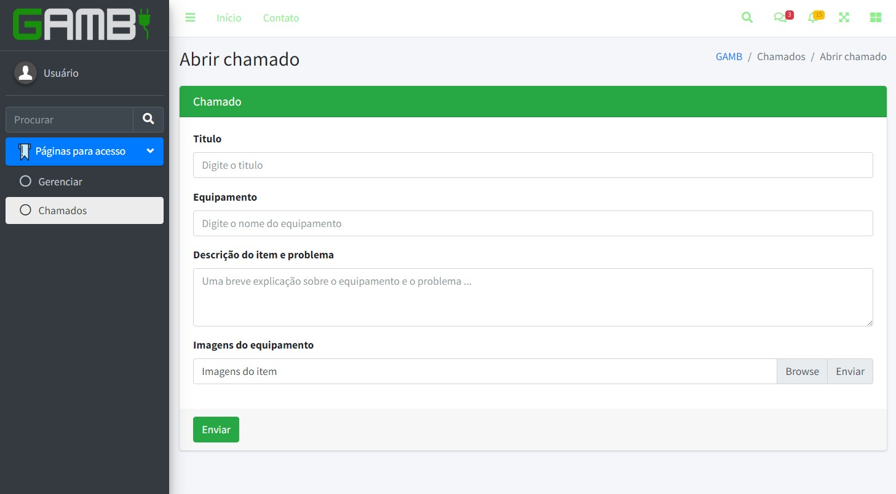

# Protótipos de Interface com o Usuário
## Mapa do Site

## Prototipos de media fidelidade

## A. Tela 1: Index

## B. Tela 2: Login

## C. Tela 3: Abrir chamado

## D. Tela 4: Detalhes chamado

## E. Tela 5: Registrar usuario

