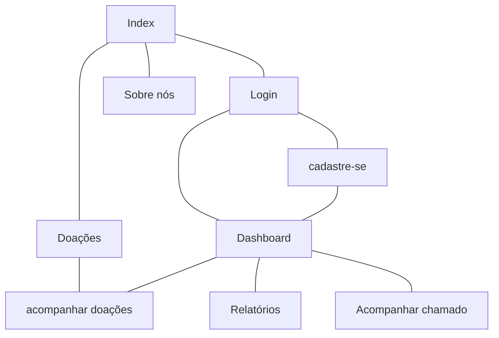
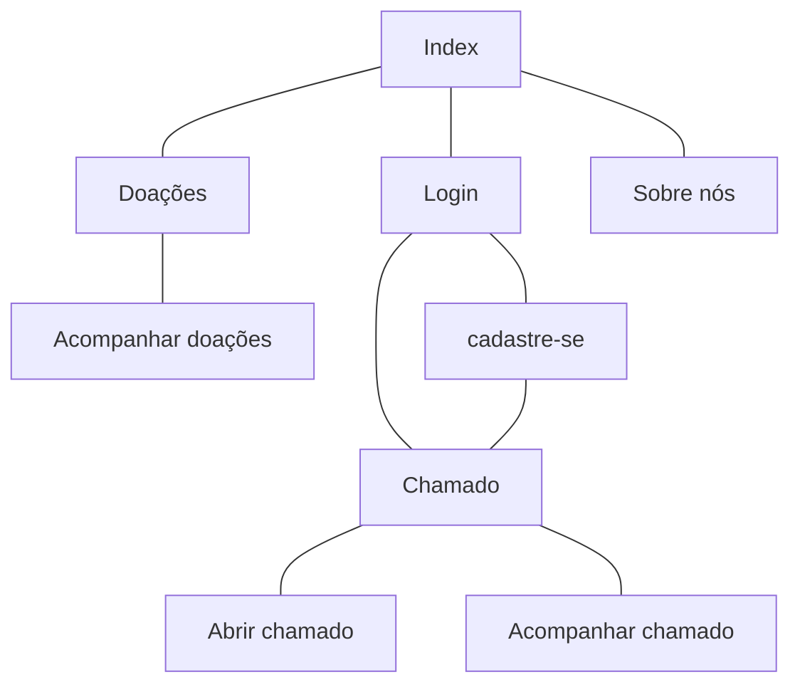

# Protótipos de Interface com o Usuário

## Mapa do Site

> Obs.: propõem-se a utilização de alguma ferramenta que possibilite a representação textual do diagrama. como o seguinte exemplo:

## Professores

## Clientes

## A. Tela 1: Index

> Obs. Substituir pela captura das imagens, sejam elas provenientes do Figma (anexar também o link para o Figma) ou já em HTML e CSS...

## B. Tela 2: Login

> Obs. Substituir pela captura das imagens, sejam elas provenientes do Figma (anexar também o link para o Figma) ou já em HTML e CSS...
