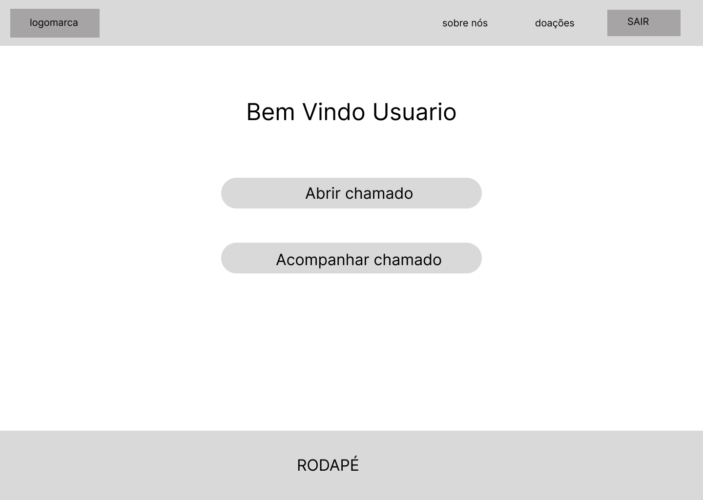
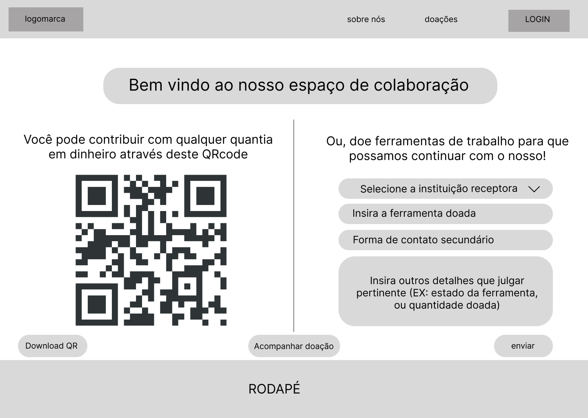
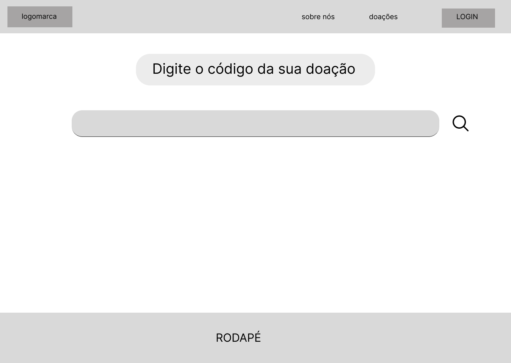
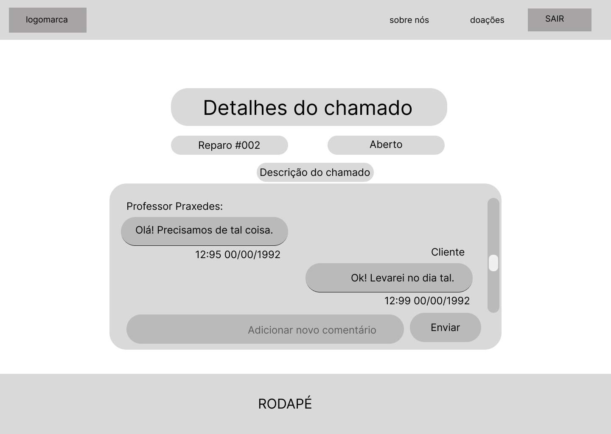

# Protótipos de Interface com o Usuário

## Mapa do Site

> Obs.: propõem-se a utilização de alguma ferramenta que possibilite a representação textual do diagrama. como o seguinte exemplo:

## A. Tela 1: Index

## B. Tela 2: Login

## C. Tela 3: Usuário logado

## D. Tela 4: Dashboard

## E. Tela 5: Doações

## F. Tela 6: Detalhes doações

## G. Tela 7: Acessar doações

## H. Tela 8: Registro

## I. Tela 9: Abrir chamado

## J. Tela 10: Acompanhar chamado #1

## L. Tela 11: Acompanhar chamado #2

