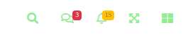
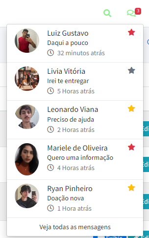
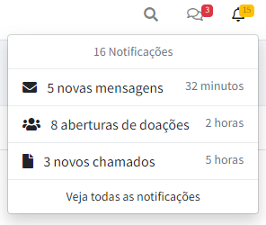
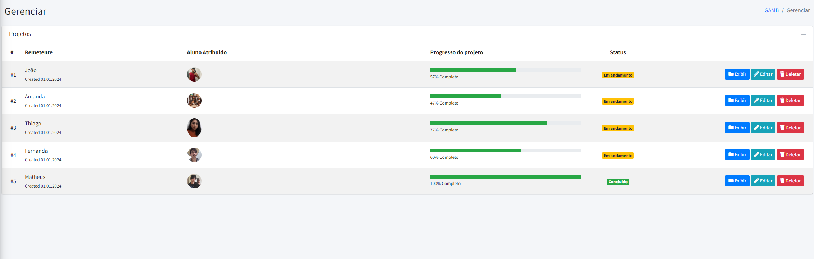
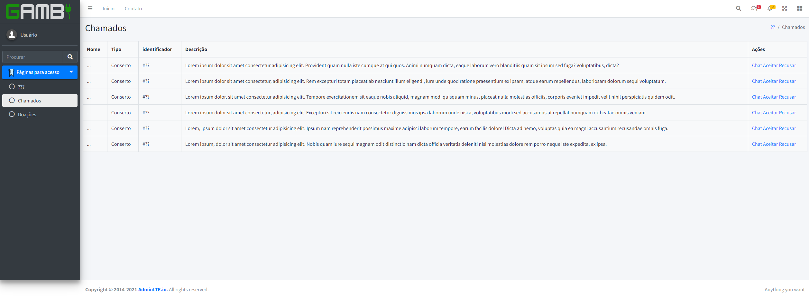
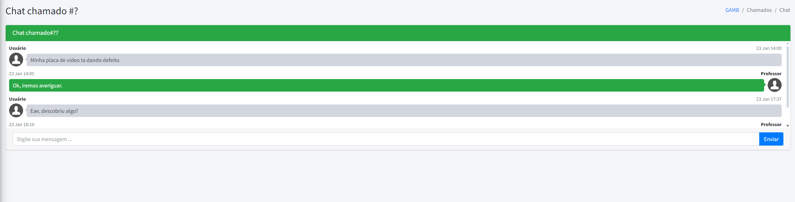
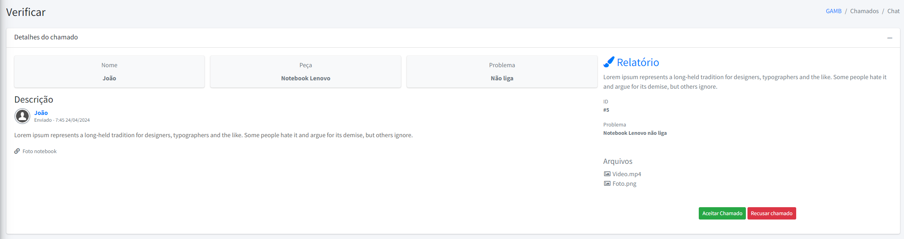

# Protótipo de tela inicial adminlte

### Funções das páginas
 
<h4> Menu aberto e fechado </h4>

 

<h4> ferramentas </h4>

<h5> Mensagens | Notificações </h5>

  

<h5> Aba chamados </h5>

 

### Telas

<h4> Tela de gerenciamento </h4>

<h4> Tela de chamados </h4>

<h4> Tela de Chat </h4>

<h4> Tela de Verificar chamado </h4>

## Observações:

<h5> Isso ainda é um protótipo e com certeza será modificado futuramente. </h5>