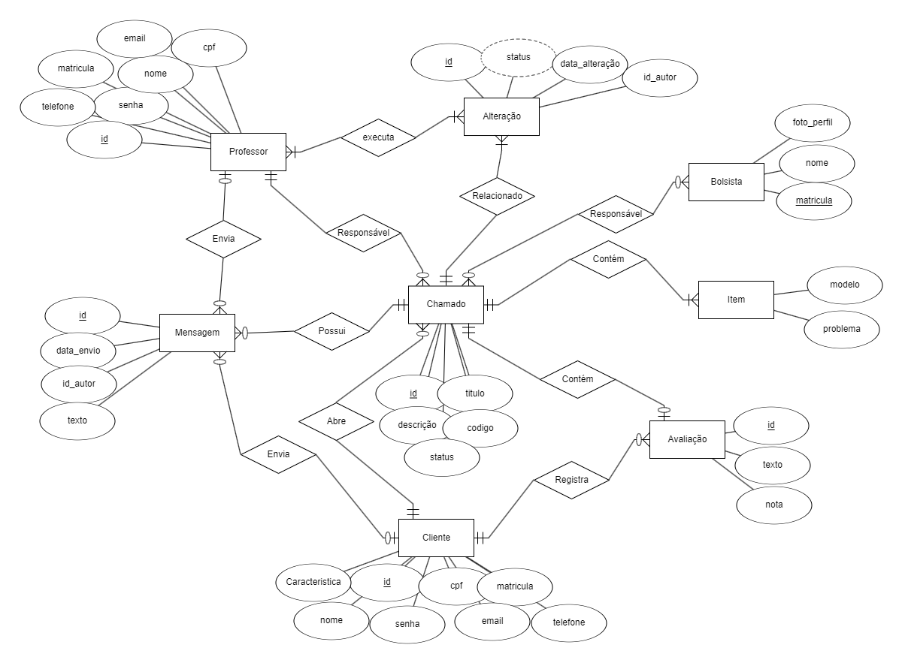
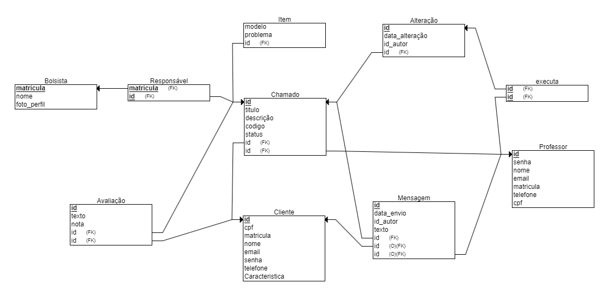

# Modelo de Dados
[Voltar a documentação](../documentacao.md)

## Diagrama ER

5º esboço com atributos e relacionamentos

O sistema terá duas entidades que agem como atores principais: Cliente e Professor.
Ambos estarão relacionados à entidade chamado.
Um chamado pode conter uma avaliação registrada pelo cliente que a abriu.
Um chamado pode possuir várias mensagens enviadas pelos dois atores principais.
Um chamado pode conter vários equipamentos.
Um ou várioas alunos podem ser atribuídos à um chamado.

## Modelo Relacional

## Dicionário de Dados

---
**Tabela**: Chamado

*Descrição*: Registro de chamados relacionados a problemas ou questões a serem resolvidas por bolsistas e professores.

*Observações*: A tabela armazena os chamados, incluindo informações sobre o título, descrição, status, e os envolvidos (bolsistas e professores).

| Colunas     | Descrição                 | Tipo de Dado | Tamanho | Null  | PK   | FK   | Unique | Identity | Default      | Check                    |
| ----------- | ------------------------- | ------------ | ------- | ----- | ---- | ---- | ------ | -------- | ------------ | ------------------------ |
| id          | Identificador do chamado   | INTEGER      |         | ❌   | ✅  | ❌  | ✅     | ✅       |              |                          |
| titulo      | Título do chamado          | VARCHAR      | 50      | ❌   | ❌  | ❌  | ❌     | ❌       |              |                          |
| descrição   | Descrição do chamado       | TEXT         | 240     | ❌   | ❌  | ❌  | ❌     | ❌       |              |                          |
| codigo      | Junção de letras e números | VARCHAR      | 6       | ❌   | ❌  | ❌  | ✅     | ❌       |              |                          |
| status      | Situação atual do chamado  | VARCHAR      | 100     | ❌   | ❌  | ❌  | ❌     | ❌       | Em análise   |                          |
| bolsistas   | Bolsistas vinculados       | INTEGER      |         | ❌   | ❌  | ✅  | ❌     | ❌       |              |                          |
| professor   | Professor vinculado        | INTEGER      |         | ❌   | ❌  | ✅  | ❌     | ❌       |              |                          |
| cliente   | Cliente vinculado        | INTEGER      |         | ❌   | ❌  | ✅  | ❌     | ❌       |              |                          |
| item   | Item Vinculado       | INTEGER      |         | ❌   | ❌  | ✅  | ❌     | ❌       |              |                          |

---

**Tabela**: User

*Descrição*: Registro dos usuários(professor e cliente).

*Observações*: A tabela armazena as informações pessoais e de contato dos professores e clientes.

| Colunas   | Descrição                | Tipo de Dado | Tamanho | Null  | PK   | FK   | Unique | Identity | Default | Check                    |
| --------- | ------------------------ | ------------ | ------- | ----- | ---- | ---- | ------ | -------- | ------- | ------------------------ |
| id        | Identificador do professor| INTEGER      |         | ❌   | ✅  | ❌  | ✅     | ✅       |         |                          |
| cpf       | CPF do professor          | VARCHAR      | 11      | ❌   | ❌  | ❌  | ✅     | ❌       |         |                          |
| matricula | Matrícula do professor    | VARCHAR      | 20      | ❌   | ❌  | ❌  | ✅     | ❌       |         |                          |
| nome      | Nome do professor         | VARCHAR      | 30      | ❌   | ❌  | ❌  | ❌     | ❌       |         |                          |
| email     | Email do professor        | VARCHAR      | 30      | ❌   | ❌  | ❌  | ❌     | ❌       |         |                          |
| senha     | Senha de acesso           | VARCHAR      | 30      | ❌   | ❌  | ❌  | ❌     | ❌       |         |                          |
| telefone  | Telefone de contato       | VARCHAR      | 15      | ❌   | ❌  | ❌  | ❌     | ❌       |         |                          |
| tipo_usuario  | Papel que o usuário desempenha      | CHOICE      | 20     | ❌   | ❌  | ❌  | ❌     | ❌       |         |                          |
---

**Tabela**: Mensagem

*Descrição*: Mensagens que compõem o chat do chamado.

*Observações*: 

| Colunas     | Descrição                         | Tipo de Dado | Tamanho | Null  | PK   | FK   | Unique | Identity | Default | Check                    |
| ----------- | --------------------------------- | ------------ | ------- | ----- | ---- | ---- | ------ | -------- | ------- | ------------------------ |
| id          | Identificador da mensagem         | INTEGER      |         | ❌   | ✅  | ❌  | ✅     | ✅       |         |                          |
| data_envio  | Data de envio da mensagem         | TIMESTAMP    |         | ❌   | ❌  | ❌  | ❌     | ❌       |         |                          |
| autor    | Identificador do autor            | INTEGER      |         | ❌   | ❌  | ✅  | ❌     | ❌       |         |                          |
| texto       | Corpo da mensagem                 | TEXT         | 240     | ❌   | ❌  | ❌  | ❌     | ❌       |         |                          |
| chamado     | Identificador do chamado vinculado| INTEGER      |         | ❌   | ❌  | ✅  | ❌     | ❌       |         |                          |

---

**Tabela**: Avaliação

*Descrição*: Avaliação vinculada a um chamado.

*Observações*: 

| Colunas     | Descrição                  | Tipo de Dado | Tamanho | Null  | PK   | FK   | Unique | Identity | Default | Check                    |
| ----------- | -------------------------- | ------------ | ------- | ----- | ---- | ---- | ------ | -------- | ------- | ------------------------ |
| id          | Identificador da avaliação  | INTEGER      |         | ❌   | ✅  | ❌  | ✅     | ✅       |         |                          |
| texto       | Comentário da avaliação     | TEXT         | 240     | ❌   | ❌  | ❌  | ❌     | ❌       |         |                          |
| nota        | Nota atribuída              | DECIMAL      | 2       | ❌   | ❌  | ❌  | ❌     | ❌       |         |                          |
| chamado     | Identificador do chamado    | INTEGER      |         | ❌   | ❌  | ✅  | ❌     | ❌       |         |                          |

---

**Tabela** : Alteracao

*Descrição* : Tabela que guarda as alterações de status de um chamado

*Observações* : 

| Colunas        | Descrição                  | Tipo de Dado | Tamanho | Null | PK  | FK  | Unique | Identity | Default | Check |
| ---------------| -------------------------- | ------------ | ------- | ---- | --- | --- | ------ | -------- | ------- | ----- |
| id             |      Identificador da Alteração                      | INTEGER      |         | ❌   | ✅  | ❌  | ✅     | ✅       |         |       |
| autor      |  Autor da alteração                          | INTEGER      |         | ❌   | ❌  | ✅  | ❌     | ❌       |         |       |
| status         |   Status atualizado                         | VARCHAR      | 30      | ❌   | ❌  | ❌  | ❌     | ❌       |         |       |
| data_alteracao | Data de mudança de status | TIMESTAMP    |         | ❌   | ❌  | ❌  | ❌     | ❌       |         |       |
| chamado        |      Identificador do chamado                      | INTEGER      |         | ❌   | ❌  | ✅  | ❌     | ❌       |         |       |

---

---
**Tabela**: Item

*Descrição*: Equipamento vinculado a um chamado

*Observações*: 

| Colunas   | Descrição                   | Tipo de Dado | Tamanho | Null  | PK   | FK   | Unique | Identity | Default | Check |
| --------- | --------------------------- | ------------ | ------- | ----- | ---- | ---- | ------ | -------- | ------- | ----- |
| id        |    Identificador do Item                        | INTEGER      |         | ❌   | ✅  | ❌  | ✅     | ✅       |         |       |
| modelo    |       Nome do equipamento                     | VARCHAR      | 30      | ❌   | ❌  | ❌  | ❌     | ❌       |         |       |
| problema |    Problema descrito                        | VARCHAR         | 30     | ❌   | ❌  | ❌  | ❌     | ❌       |         |       |

---

