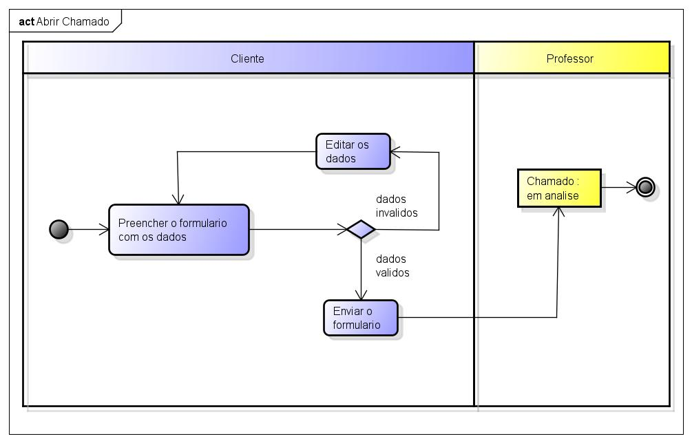
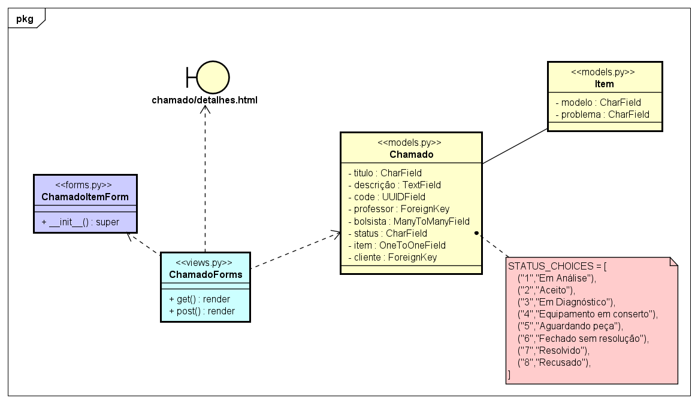

# CDU - Abrir chamado

- **Ator principal**: Cliente
- **Atores secundários**: ...	 
- **Resumo**: Neste caso de uso, o cliente pode abrir um chamado e registrar seu problema a ser resolvido
- **Pré-condição**: Estar logado no sistema.
- **Pós-Condição**: O sistema apresenta a tela de detalhes do chamado.

## Fluxo Principal
| Ações do ator | Ações do sistema |
| :-----------------: | :-----------------: | 
| 1 - O usuário clica no botão de abrir chamado | |  
| | 2 - O sistema carrega um formulário para a criação de um chamado | 
| 3 - O usuário preenche as informações titulo, descrição e o modelo do item, entao clica no botão de envio para criar o chamado | | 
| | 4 - O sistema registra as informações e redireciona o usuário para página de detalhamento do chamado |  

## Fluxo Alternativo I - Cadastrar um acessório do item
Segue o ajuste:  

| **Ações do ator** | **Ações do sistema** |  
|:------------------:|:--------------------:|  
| 3.1 - O usuário preenche as informações de título, descrição e modelo do item e clica no botão para adicionar um acessório. | |  
| | 4 - O sistema exibe um campo para ser preenchido com o nome do acessório. |  
| 5 - O usuário preenche a informação do acessório, entao clica no botão de envio para criar o chamado | |  
| | 6 - O sistema registra as informações e redireciona o usuário para a página de detalhamento do chamado. |  

## Fluxo Alternativo II - Campo não preenchido
| Ações do ator | Ações do sistema |
| :-----------------: |:-----------------: | 
| 1 - O usuário não preenche todos os campos do formulário | |  
| | 2 - O sistema exibe mensagem de erro sinalizando que os campos não foram preenchidos |

## Diagrama de atividades - Abrir Chamado

## Diagrama de classe de projeto - Abrir Chamado

[Voltar aos Casos de Uso](../cdu.md)
