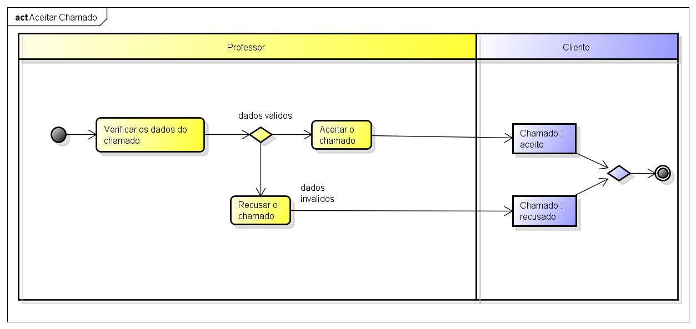

# CDU - Aceitar chamado

- **Ator principal**: Professor
- **Atores secundários**: ...	 
- **Resumo**: Neste caso de uso, o professor pode aceitar o chamado
- **Pré-condição**: Estar logado no sistema na lista de chamados
- **Pós-Condição**: O sistema redireciona o professor para a tela de detalhes do chamado

## Fluxo Principal
| Ações do ator | Ações do sistema |
| :-----------------: | :-----------------: | 
| 1 - O Professor, na linha do chamado pretendido,  clica no botão de aceitar | |  
| | 2 -  O sistema redireciona o Professor para a página de detalhes do chamado, exibe mensagem de sucesso e o status atualizado | 

## Diagrama de atividades - Aceitar Chamado

## Diagrama de Sequência - Aceitar Chamado

