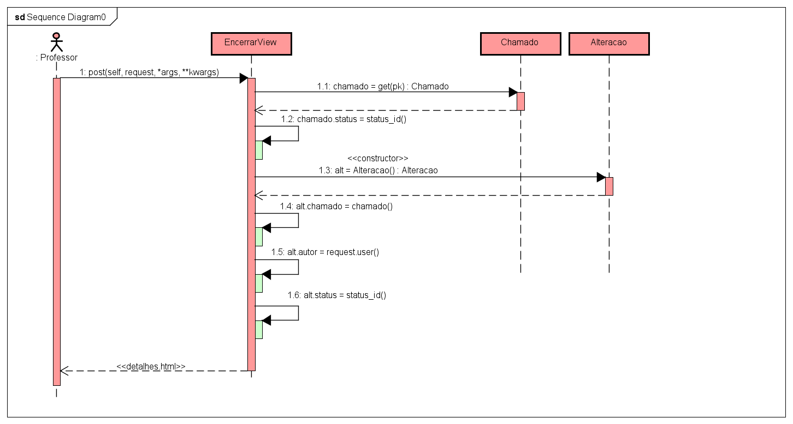

# CDU - Encerrar chamado

-   **Ator principal**: Professor
-   **Atores secundários**: ...
-   **Resumo**: Neste caso de uso, o professor pode encerrar o chamado
-   **Pré-condição**: Estar logado no sistema e estar na página de listagem dos chamados
-   **Pós-Condição**: O sistema redireciona o professor para a tela de detalhes do chamado com o status atualizado

## Fluxo Principal

|                                Ações do ator                                |                                            Ações do sistema                                             |
| :-------------------------------------------------------------------------: | :-----------------------------------------------------------------------------------------------------: | --- |
| 1 - O Professor, na linha do chamado pretendido, clica no botão de encerrar |                                                                                                         |     |
|                                                                             |                 2 - O sistema abre uma modal de confirmação do encerramento do chamado                  |
|        3 - O Professor confirma a ação clicando no botão de encerrar        |                                                                                                         |
|                                                                             | 4 - O sistema redireciona o Professor para a página de detalhes do chamado, e exibe o status atualizado |

## Fluxo Alternativo I - Cancelar Encerramento

|                                Ações do ator                                |                            Ações do sistema                            |
| :-------------------------------------------------------------------------: | :--------------------------------------------------------------------: | --- |
| 1 - O Professor, na linha do chamado pretendido, clica no botão de encerrar |                                                                        |     |
|                                                                             | 2 - O sistema abre uma modal de confirmação do encerramento do chamado |
|        3 - O Professor desiste da ação clicando no botão de cancelar        |                                                                        |
|                                                                             |       4 - O sistema fecha o modal de confirmação de encerramento       |

## Diagrama de Sequência - Encerrar Chamado

[Voltar aos Casos de Uso](../cdu.md)
