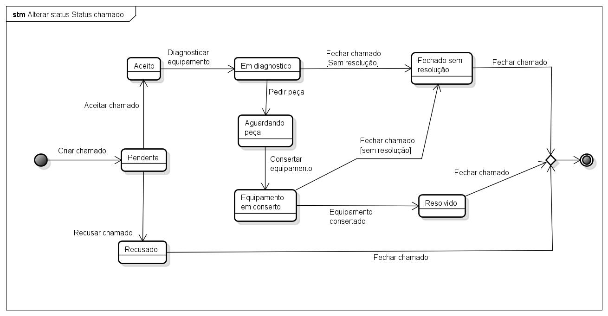

# CDU - Alterar status do chamado

- **Ator principal**: Professor
- **Atores secundários**: ...	 
- **Resumo**: Neste caso de uso, o professor pode alterar o status do chamado.
- **Pré-condição**: Estar logado no sistema e estar na página de detalhes do chamado.
- **Pós-Condição**: O sistema altera o status do chamado para o status escolhido

## Fluxo Principal
| Ações do ator | Ações do sistema |
| :-----------------: | :-----------------: | 
| 1 - O Professor, na listagem dos chamados, clica no botão de alterar status || |  
| | 2 -  O sistema mostra uma lista com os status disponíveis | 
| 3 - O Professor seleciona o status desejado e clica em enviar|| |     
| | 4 - O sistema altera o status do chamado e retorna uma mensagem de sucesso |   

## Diagrama de estados - Alterar status do chamado

[Voltar aos Casos de Uso](../cdu.md)

