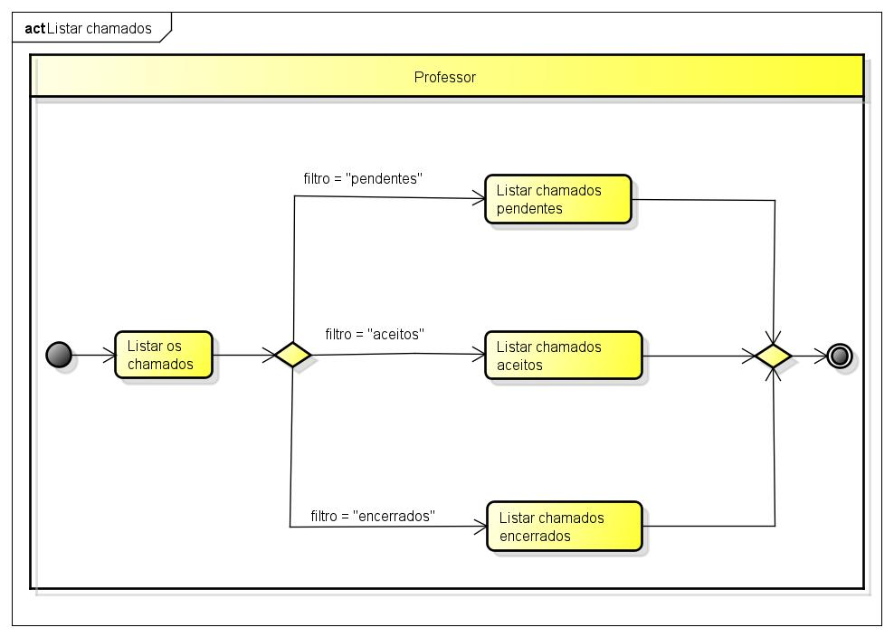
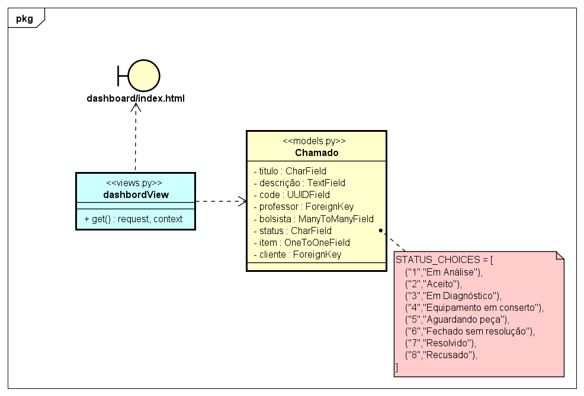

# CDU - Listar Chamados

- **Ator principal**: Professor
- **Atores secundários**: Cliente, Bolsista
- **Resumo**: Neste caso de uso, o professor pode listar chamados
- **Pré-condição**: Estar logado no sistema e estar na página de listagem dos chamados
- **Pós-Condição**: O professor visualiza todos chamados

## Fluxo Principal
| Ações do ator | Ações do sistema |
| :-----------------: | :-----------------: |
| 1 - O professor realiza login no sistema || |  
| | 2 -  O sistema redireciona o Professor a página principal da dashboard e exibe a lista todos os chamados |    

## Fluxo Alternativo I - Listar chamados pendentes
| Ações do ator | Ações do sistema |
| :-----------------: |:-----------------: | 
| 1 - O professor realize login no sistema || |  
| | 2 - O sistema redireciona o Professor a página principal da dashboard e exibe a lista todos os chamados | 
| 3 - O professor seleciona o filtro de chamados pendentes | |  
| | 4 - O sistema mostra apenas os chamados pendentes|

## Fluxo Alternativo II - Listar chamados aceitos
| Ações do ator | Ações do sistema |
| :-----------------: |:-----------------: | 
| 1 - O professor realize login no sistema || |  
| | 2 - O sistema redireciona o Professor a página principal da dashboard e exibe a lista todos os chamados | 
| 3 - O professor seleciona o filtro de chamados aceitos | |  
| | 4 - O sistema mostra apenas os chamados aceitos|

## Fluxo Alternativo III - Listar chamados fechados
| Ações do ator | Ações do sistema |
| :-----------------: |:-----------------: | 
| 1 - O professor realize login no sistema || |  
| | 2 - O sistema redireciona o Professor a página principal da dashboard e exibe a lista todos os chamados | 
| 3 - O professor seleciona o filtro de chamados fechados | |  
| | 4 - O sistema mostra apenas os chamados fechados |

## Diagrama de atividades - Listar Chamados

## Diagrama de classe de projeto - Listar Chamado

[Voltar aos Casos de Uso](../cdu.md)