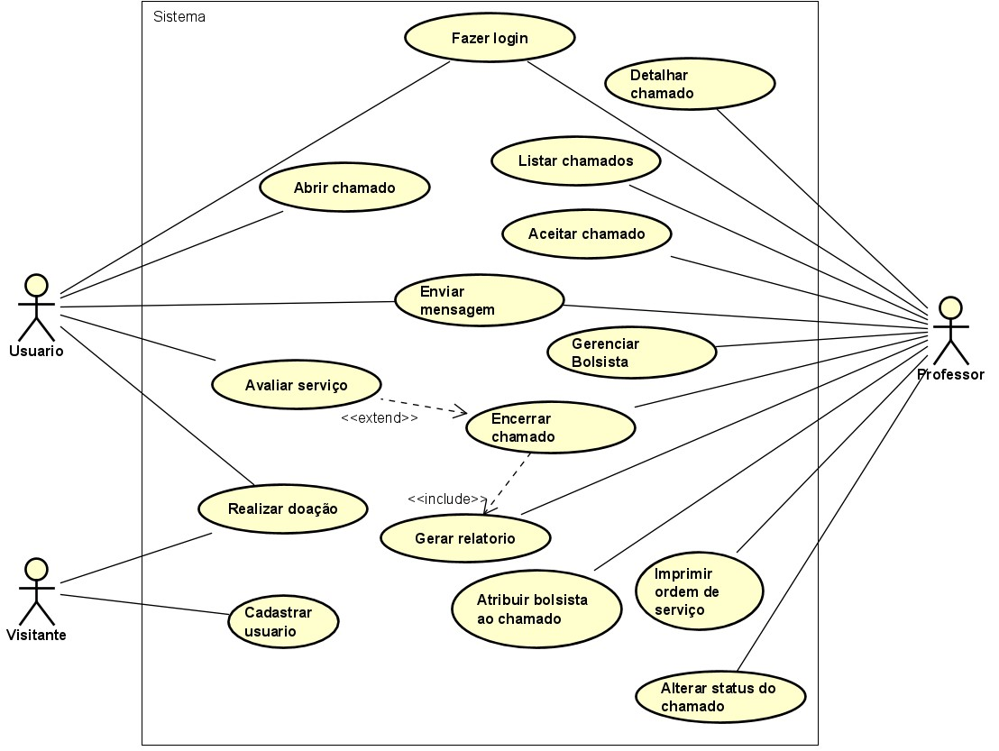
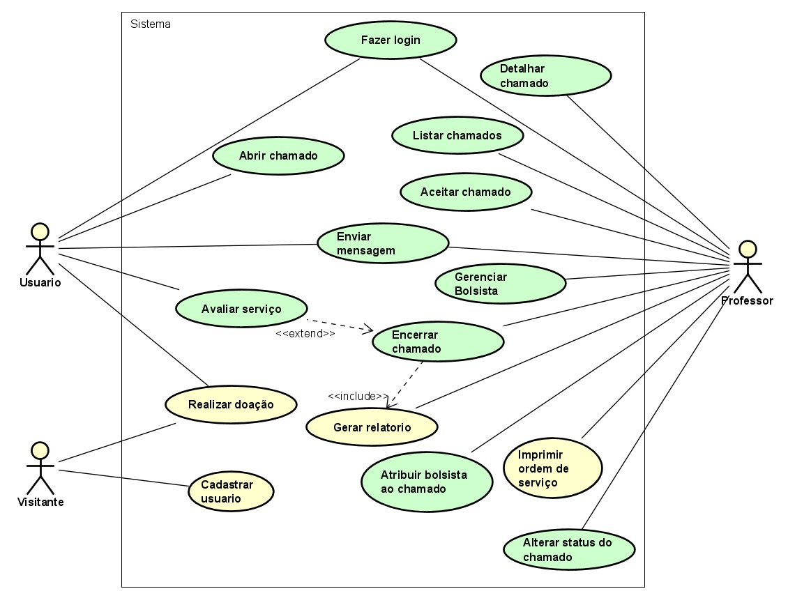

# Modelo de Casos de Uso
[Voltar a documentação](../documentacao.md)

## 1. Diagrama de Caso de Uso

## 2. Listagem dos detalhamentos dos casos de uso

01. [CDU-001 - Abrir chamado](cdu-001-abrir-chamado/cdu_abrir_chamado.md)
02. [CDU-002 - Analisar Chamado](cdu-002-analisar-chamado/cdu_analisar_chamado.md)
03. [CDU-003 - Encerrar chamado](cdu-003-encerrar-chamado/cdu_encerrar_chamado.md)
04. [CDU-004 - Detalhar chamado](cdu-004-Detalhar-chamado/cdu_detalhar_chamado.md)
05. [CDU-005 - Alterar status do chamado](cdu-005-Alterar-status-chamado/cdu_alterar_status_chamado.md)
06. [CDU-006 - Avaliar chamado](cdu-006-avaliar-chamado/cdu_avaliar_chamado.md)
07. [CDU-007 - Listar chamados](cdu-007-Listar-chamdos/cdu_listar_chamado.md)
08. [CDU-008 - Gerenciar bolsistas](cdu-008-Gerenciar-bolsistas/cdu_gerenciar_bolsistas.md)
09. [CDU-009 - Atribuir bolsista](cdu-009-Atribuir-bolsistas/cdu_atribuir_bolsista.md)
10. [CDU-010 - Envio de mensagens](cdu-010-Envio-de-mensagens/cdu_envio_mensagem.md)
11. [CDU-011 - Gerar ordem de serviço](cdu-011-Gerar-ordem-de-servico/cdu_gerar_ordem_de_servico.md)
12. [CDU-012 - Login no Sistema](cdu-012-Login/cdu_login.md)
13. [CDU-013 - Criar Conta](cdu-013-criar-conta/cdu_criar_conta.md)

## 3. Casos de uso implementados

### Os casos de uso em verde foram implementados

