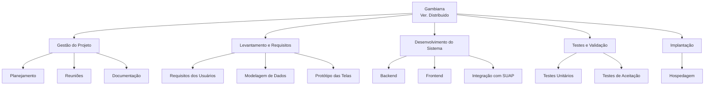

# Planejamento do Escopo do Projeto

[Voltar a documentação](../documentacao.md)

## 1. Objetivo SMART do Projeto

**Específico**: Desenvolver um sistema web para gerenciamento de chamados de manutenção técnica de computadores no IFRN-CNAT, promovendo a prática profissional dos alunos de suporte à comunidade escolar e externa.

**Mensurável**: O sistema deve estar funcionando e disponível na rede para acesso público.

**Atingível**: O projeto será desenvolvido por alunos com orientação docente, utilizando as tecnologias React, DjangoRest, AWS.

**Relevante**: Atende às demandas das disciplinas e oferece à comunidade um serviço de manutenção confiável e de sem custo.

**Temporal**: Concluir o desenvolvimento da versão distribuída até o fim do semestre letivo (13/08/2025)

## 2. Declaração do Escopo

### Escopo do Projeto

- Desenvolvimento de um sistema web responsivo para gerenciamento de chamados de manutenção técnica.
- Cadastro e autenticação de usuários (professores, clientes, bolsistas).
- Integração com SUAP para autenticação de usuários.
- Abertura, acompanhamento e encerramento de chamados de manutenção por professores e clientes.

### Fora do Escopo

- Atendimento a chamados fora do ambiente do IFRN-CNAT.
- Suporte técnico presencial aos usuários finais do sistema.
- Desenvolvimento de aplicativo mobile nativo.
- Atendimento a chamados fora da área de tecnologia.
- Integração com sistemas de pagamento ou cobrança.

## 3. Estrutura Analítica do Projeto (EAP)

## 4. Dicionário da EAP

| Código | Termo Técnico | Descrição |
|--------|------|-----------|
| 2.1 | Requisitos do Usuário | Funcionalidades e necessidades mapeadas junto ao usuário. |
| 2.2 | Modelagem de Dados | Representação estrutural dos dados, suas entidades e relacionamentos. |
| 2.3 | Protótipo das Telas | Representações visuais fiéis da interface do sistema. |
| 3.1 | Backend | Parte do sistema responsável pela lógica de negócios e acesso a dados. |
| 3.2 | Frontend | Camada de interface gráfica com a qual o usuário interage. |
| 3.3 | Integração com SUAP | Comunicação com o sistema do SUAP para autenticação dos usuários. |
| 4.1 | Testes Unitários | Verificações automatizadas de pequenas partes do código. |
| 4.2 | Testes de Aceitação | Testes realizados com base nos critérios definidos pelo usuário final. |
| 5.1 | Hospedagem | Publicação do sistema em ambiente acessível via internet. |
