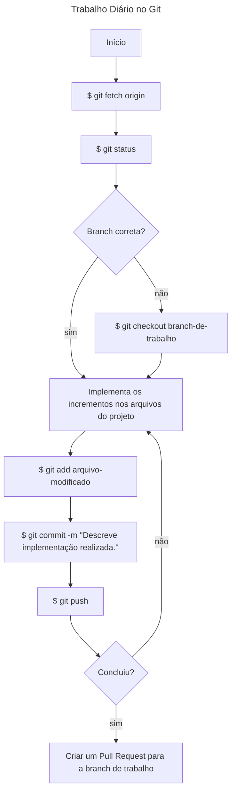

# Guia do Desenvolvedor 

**Histórico de Alterações:**
| Versão | Autor | Data |
|--------|-------|------|
|  1.0  | Fellipe Aleixo | 11 de abril de 2023 |
|  2.0  | Livia Vitória | 28 de outubro de 2024 |

# Projeto de Desenvolvimento de Sistemas Web

## A. Preparativos para se trabalhar com o GitHub

1. Na sua máquina local DEVE ser verificada se já existem chaves SSH (previamente geradas) - [GUIA de como verificar a existência de chaves SSH](https://docs.github.com/pt/authentication/managing-commit-signature-verification/checking-for-existing-gpg-keys);
1. Não existindo, deve ser criado um par de chaves SSH - [GUIA de como criar chaves SSH](https://docs.github.com/pt/authentication/managing-commit-signature-verification/generating-a-new-gpg-key);
1. Uma vez criadas as chaves, a chave pública DEVE ser associada a uma conta do GitHub - [GUIA de como adicionar uma chave pública a uma conta do GitHub](https://docs.github.com/pt/authentication/managing-commit-signature-verification/adding-a-gpg-key-to-your-github-account);

## B. Clonando o Projeto na Máquina Local

1. Antes de iniciar os trabalhos, o projeto precisa ser clonado na máquina local. Para tanto é necessário que o processo de configuração das chaves SSH tenha ocorrido anteriormente;
~~~shell
$ git clone https://github.com/tads-cnat/exemplo.git
~~~

## C. Fluxo ao Ser Atribuído em Tarefas

1. Uma nova tarefa é atribuída a um desenvolvedor;
1. O desenvolvedor lê a tarefa e solicita possíveis esclarecimentos ao gerente a partir de comentários na tarefa, marcando o gerente;
1. **[opcional]** se a tarefa for considerada muito grande, a mesma "pode" ser quebrada em tarefas menores e atribuídas a um dos membros da equipe;
1. Para a realização da tarefa, DEVE ser criado um novo ramo (*branch*) do ramo principal (*main*). **Padrão**: ((num da issue))-nome-projeto - o que pode ser feito a partir da interface do GitHub;
1. As contribuições individuais DEVEM ser intergadas ao ramo de trabalho, através de *commits*;
1. Quando o trabalho atingir um nível intermediário, o gerente pode ser notificado do progresso a partir da abertura de uma solicitação de integração (*Pull Request*). O gerente deve ser atribuído como responsável pelo *Pull Request*;
1. O gerente pode avaliar as entregas parciais e esclarecer possíveis dúvidas ou solicitar correções através de comentários adicionados ao *Pull Request*, marcando o desenvolvedor rsposnável pelas correções;
1. O desenvolvedor responsável realiza as correções e ajustes solicitados e integra os mesmos através de novos *commits*;
1. Ao final do trabalho o *Pull Request* é sinalizado que não trata-se de um rascunho (*draft*);
1. O gerente integra o resultado do trabalho (contido na *branch* de trabalho) à *branch* princial (*main*).

## D. Passos do Trabalho Diário com o Git

- Inicialmente, o repositório local DEVE ser sincronizado com as possíveis novidades do repositório remoto (*origin*);
~~~shell
$ git fetch origin
~~~
- Deve ser verificado se o desenvolvedor se encontra da *branch* de trabalho;
~~~shell
$ git status
~~~ 
- Caso não esteja no lugar certo, deve acessar a *branch* de trabalho;
~~~shell
$ git checkout branch-de-trabalho
~~~
- Só então as contribuições no código poderão ser realizadas. Uma vez que as contribuições foram realizadas (edição de arquivos do projeto), as mesmas podem ser "salvas" no repositório;
~~~shell
$ git status
$ git add arquivo-modificado
$ git commit -m "Descrição resumo do que foi implementado."
~~~
- Ao finalizar o dia de trabalho, é uma boa prática que o repositório local seja sincronizado com o repositório remoto.
~~~shell
$ git push
~~~

## Guia de contribuição ao projeto
---

### Como devo nomear minha issue? 🤔
---
##### 1° Passo:
| Deve usar uma linguagem objetiva e clara das atividades a serem realizadas naquela tarefa. 

##### 2° Passo:

| Faça o uso da linguagem `imperativa`:

_Exemplos_: 
``"Corrigir erro na validação do formulário de login"``

``"Adicionar opção de filtro por data na listagem de pedidos"``

``"Remover opções duplicadas no menu de configuração"``

### Como devo nomear minha branch? 🤔

`N° da issue seguida do seu nome`
exemplo:

    1-minha-primeira-issuo

### Como devo nomear meu commit? 🤔

`#Antesdetudo` A regra é simples: 
- "Release early, release often!"
- Commitar cedo, commitar como frequência.

---

O seu commit vai mudar de acordo com o propósito das mudanças aplicadas, como via de regra deve respeitar esse formato:

~~~markdown
"<emoji-da-tag> <tag>: O que esse commit faz?. #<numero-da-issue>"
~~~
 

Segue exemplos

1. **`:recycle:` ♻️ `refac:`** _Refatoração de código. Não há adição de novas funcionalidades nem correções de bugs. Apenas melhorias na estrutura, organização, ou legibilidade do código._  
   _Exemplo:_ `♻️ refac: melhora a lógica de cálculo de desconto`

 

2. **`:heavy_plus_sign:` ➕ `feat:`** _Adição de um novo recurso ou funcionalidade ao projeto._  
   _Exemplo:_ `➕ feat: implementa o sistema de autenticação de usuário`

 

3. **`:books:` 📚 `docs:`** _Alterações relacionadas à documentação, como README, arquivos de ajuda, ou comentários no código._  
   _Exemplo:_ ` 📚 docs: adiciona instruções de configuração no README`

 

4. **`:bug:` 🐛 `fix:`** _Correção de um bug existente._  
   _Exemplo:_ `🐛 fix: corrige erro na validação de e-mail`

 

5. **`:art:` 🎨 `style:`** _Alterações relacionadas a formatação e estilo do código (espaços, vírgulas, indentação, etc.) que não afetam a lógica do sistema._  
   _Exemplo:_ `🎨 style: ajusta indentação no arquivo main.js`

 

6. **`:fire:` 🔥 `remove:`** _Remoção de código ou arquivos desnecessários._  
   _Exemplo:_ `🔥 remove: apaga componentes não utilizados`

 

7. **`:zap:` ⚡ `perf:`** _Melhorias de desempenho, focadas em otimizar a velocidade ou reduzir a utilização de recursos._  
   _Exemplo:_ `⚡ perf: otimiza a consulta ao banco de dados`

 

8. **`:truck:` 🚚 `move:`** _Mover ou renomear arquivos ou diretórios._  
   _Exemplo:_ `🚚 move: reorganiza os arquivos para nova estrutura de diretórios`

 

9. **`:wrench:` 🔧 `chore:`** _Tarefas de manutenção que não impactam o funcionamento ou funcionalidades, como atualização de dependências._  
   _Exemplo:_ `🔧 chore: atualiza versão do pacote lodash`

 

10. **`:test_tube:` 🧪 `test:`** _Adição ou modificação de testes de código._  
    _Exemplo:_ `🧪 test: adiciona testes unitários para módulo de autenticação`

 

11. **`:construction:` 🚧 `WIP:`** _Indica que o commit é de um trabalho em progresso (Work In Progress), e não é uma versão final._  
    _Exemplo:_ `🚧 WIP: desenvolve a nova página de perfil`