```mermaid
---
title: Trabalho Diário no Git
---
flowchart TD
    inicio[Início]
    fetch[$ git fetch origin]
    status[$ git status]
    se1{Branch correta?}
    se2{Concluiu?}
    checkout[$ git checkout branch-de-trabalho]
    edita[Implementa os incrementos nos arquivos do projeto]
    commit1[$ git add arquivo-modificado]
    commit2[$ git commit -m ''Descreve implementação realizada.'']
    push[$ git push]
    merge[Criar um Pull Request para a branch de trabalho]
    
    inicio --> fetch
    fetch --> status
    status --> se1
    se1 -->|sim| edita
    se1 -->|não| checkout
    checkout --> edita
    edita --> commit1
    commit1 --> commit2
    commit2 --> push
    push --> se2
    se2 -->|não| edita
    se2 -->|sim| merge
```

# Guia do Desenvolvedor

**Histórico de Alterações:**
| Versão | Autor | Data |
|--------|-------|------|
| 1.0 | Fellipe Aleixo | 11 de abril de 2023 |
| 2.0 | Livia Vitória | 28 de outubro de 2024 |

# Projeto de Desenvolvimento de Sistemas Web

## A. Preparativos para se trabalhar com o GitHub

1. Na sua máquina local DEVE ser verificada se já existem chaves SSH (previamente geradas) - [GUIA de como verificar a existência de chaves SSH](https://docs.github.com/pt/authentication/managing-commit-signature-verification/checking-for-existing-gpg-keys);
2. Não existindo, deve ser criado um par de chaves SSH - [GUIA de como criar chaves SSH](https://docs.github.com/pt/authentication/managing-commit-signature-verification/generating-a-new-gpg-key);
3. Uma vez criadas as chaves, a chave pública DEVE ser associada a uma conta do GitHub - [GUIA de como adicionar uma chave pública a uma conta do GitHub](https://docs.github.com/pt/authentication/managing-commit-signature-verification/adding-a-gpg-key-to-your-github-account);

## B. Clonando o Projeto na Máquina Local

1. Antes de iniciar os trabalhos, o projeto precisa ser clonado na máquina local. Para tanto é necessário que o processo de configuração das chaves SSH tenha ocorrido anteriormente;

```shell
$ git clone https://github.com/tads-cnat/exemplo.git
```

## C. Fluxo ao Ser Atribuído em Tarefas

1. Uma nova tarefa é atribuída a um desenvolvedor pelo scrum master;
2. **[opcional]** se a tarefa for considerada muito grande, a mesma "pode" ser quebrada em tarefas menores e atribuídas a um dos membros da equipe;
3. Para a realização da tarefa, DEVE ser criado um novo ramo (_branch_) do ramo principal (_main_). **Padrão**: ((num da issue))-nome-projeto - o que pode ser feito a partir da interface do GitHub;
4. As contribuições individuais DEVEM ser intergadas ao ramo de trabalho, através de _commits_ que seguem o [padrão](#padrao) estabelecido;
5. Quando o tarefa for concluída, o scrum master pode ser notificado do progresso a partir da abertura de uma solicitação de integração (_Pull Request_). O scrum master deve ser atribuído como responsável pelo _Pull Request_;
6. O scrum master pode avaliar as entregas e esclarecer possíveis dúvidas ou solicitar correções através de comentários adicionados ao _Pull Request_, marcando o desenvolvedor rsposnável pelas correções;
7. O desenvolvedor responsável realiza as correções e ajustes solicitados e integra os mesmos através de novos _commits_;
8. Ao final do trabalho o _Pull Request_ é sinalizado que não trata-se de um rascunho (_draft_);
9. O gerente integra o resultado do trabalho (contido na _branch_ de trabalho) à _branch_ princial (_dev_, _dev-front_, _dev-back_ ou _main_).

## D. Passos do Trabalho Diário com o Git

- Inicialmente, o repositório local DEVE ser sincronizado com as possíveis novidades do repositório remoto (_origin_);

```shell
$ git fetch origin
```

- Deve ser verificado se o desenvolvedor se encontra da _branch_ de trabalho;

```shell
$ git status
```

- Caso não esteja no lugar certo, deve acessar a _branch_ de trabalho;

```shell
$ git checkout branch-de-trabalho
```

- Só então as contribuições no código poderão ser realizadas. Uma vez que as contribuições foram realizadas (edição de arquivos do projeto), as mesmas podem ser "salvas" no repositório;

```shell
$ git status
$ git add arquivo-modificado
$ git commit -m "Descrição resumo do que foi implementado."
```

- Ao finalizar o dia de trabalho, é uma boa prática que o repositório local seja sincronizado com o repositório remoto.

```shell
$ git push
```



## Guia de contribuição ao projeto <a name="padrao"></a>

### Como devo criar e nomear minha issue? 🤔

---

##### 1° Passo:

| Deve usar uma linguagem objetiva e clara das atividades a serem realizadas naquela tarefa.

##### 2° Passo:

| Faça o uso da linguagem `imperativa`:

_Exemplos_:
`"Corrigir erro na validação do formulário de login"`

`"Adicionar opção de filtro por data na listagem de pedidos"`

`"Remover opções duplicadas no menu de configuração"`

##### 3° Passo:

| Defina as informações da ISSUE:

```markdown
**Tempo previsto (em horas):**

**Tempo gasto (em horas):**

**Esforço da tarefa (1 a 5):**

| Número |  Dificuldade  | Descrição                          |
| :----: | :-----------: | :--------------------------------- |
|   1    |  Muito fácil  | Tarefa simples e rápida            |
|   2    |     Fácil     | Exige atenção mínima               |
|   3    |   Moderado    | Requer esforço e atenção           |
|   4    |    Difícil    | Exige dedicação significativa      |
|   5    | Muito difícil | Requer habilidade avançada e tempo |

**Descrição**

- [ ] subtarefa
```

_Exemplos_:

```markdown
**Tempo previsto (em horas):** 2h

**Tempo gasto (em horas):**

**Esforço da tarefa (1 a 5):** 4

| Número | Dificuldade | Descrição                     |
| :----: | :---------: | :---------------------------- |
|   4    |   Difícil   | Exige dedicação significativa |

**Descrição**

- [ ] criar tabela de exibição
- [ ] consumir API
```

### Como devo nomear minha branch? 🤔

`N° da issue seguida do seu nome`
exemplo:

    1-minha-primeira-issuo

### Como devo nomear meu commit? 🤔

`#Antesdetudo` A regra é simples:

- "Release early, release often!"
- Commitar cedo, commitar como frequência.

---

O seu commit vai mudar de acordo com o propósito das mudanças aplicadas, como via de regra deve respeitar esse formato:

```markdown
"<emoji-da-tag> <tag>: O que esse commit faz?. #<numero-da-issue>"
```

<br>

Segue exemplos

1. **`:recycle:` ♻️ `refac:`** _Refatoração de código. Não há adição de novas funcionalidades nem correções de bugs. Apenas melhorias na estrutura, organização, ou legibilidade do código._  
   _Exemplo:_ `♻️ refac: melhora a lógica de cálculo de desconto. #13`

<br>

2. **`:heavy_plus_sign:` ➕ `feat:`** _Adição de um novo recurso ou funcionalidade ao projeto._  
   _Exemplo:_ `➕ feat: implementa o sistema de autenticação de usuário. #13`

<br>

3. **`:books:` 📚 `docs:`** _Alterações relacionadas à documentação, como README, arquivos de ajuda, ou comentários no código._  
   _Exemplo:_ ` 📚 docs: adiciona instruções de configuração no README. #13`

<br>

4. **`:bug:` 🐛 `fix:`** _Correção de um bug existente._  
   _Exemplo:_ `🐛 fix: corrige erro na validação de e-mail. #13`

<br>

5. **`:art:` 🎨 `style:`** _Alterações relacionadas a formatação e estilo do código (espaços, vírgulas, indentação, etc.) que não afetam a lógica do sistema._  
   _Exemplo:_ `🎨 style: ajusta indentação no arquivo main.js. #13`

<br>

6. **`:fire:` 🔥 `remove:`** _Remoção de código ou arquivos desnecessários._  
   _Exemplo:_ `🔥 remove: apaga componentes não utilizados. #13`

<br>

7. **`:zap:` ⚡ `perf:`** _Melhorias de desempenho, focadas em otimizar a velocidade ou reduzir a utilização de recursos._  
   _Exemplo:_ `⚡ perf: otimiza a consulta ao banco de dados`

<br>

8. **`:truck:` 🚚 `move:`** _Mover ou renomear arquivos ou diretórios._  
   _Exemplo:_ `🚚 move: reorganiza os arquivos para nova estrutura de diretórios. #13`

<br>

9. **`:wrench:` 🔧 `chore:`** _Tarefas de manutenção que não impactam o funcionamento ou funcionalidades, como atualização de dependências._  
   _Exemplo:_ `🔧 chore: atualiza versão do pacote lodash. #13`

<br>

10. **`:test_tube:` 🧪 `test:`** _Adição ou modificação de testes de código._  
    _Exemplo:_ `🧪 test: adiciona testes unitários para módulo de autenticação. #13`

<br>

11. **`:construction:` 🚧 `WIP:`** _Indica que o commit é de um trabalho em progresso (Work In Progress), e não é uma versão final._  
    _Exemplo:_ `🚧 WIP: desenvolve a nova página de perfil. #13`
