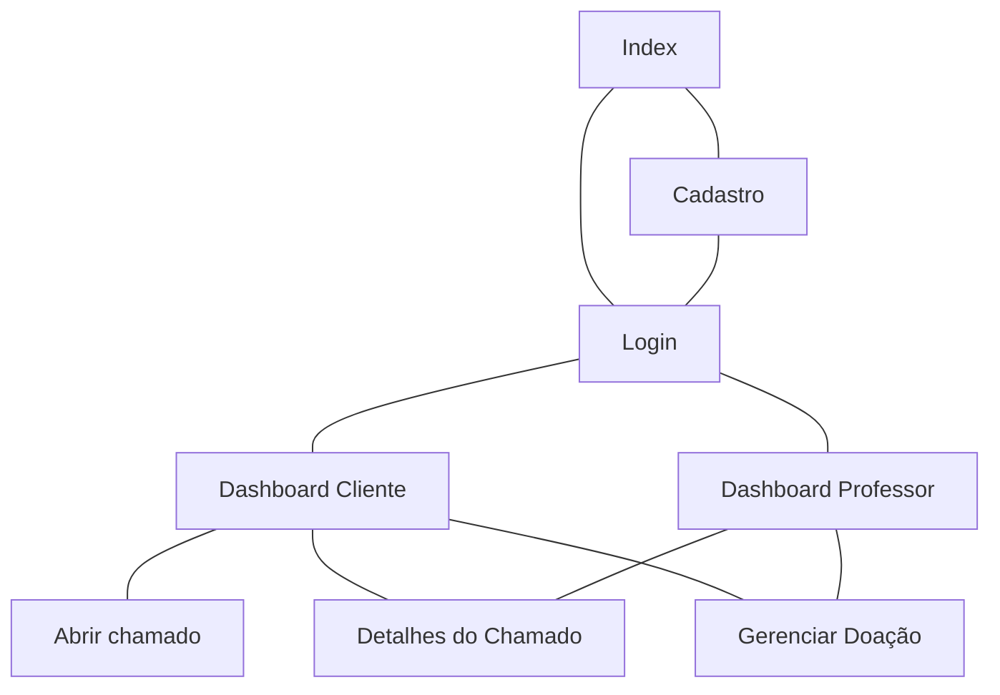
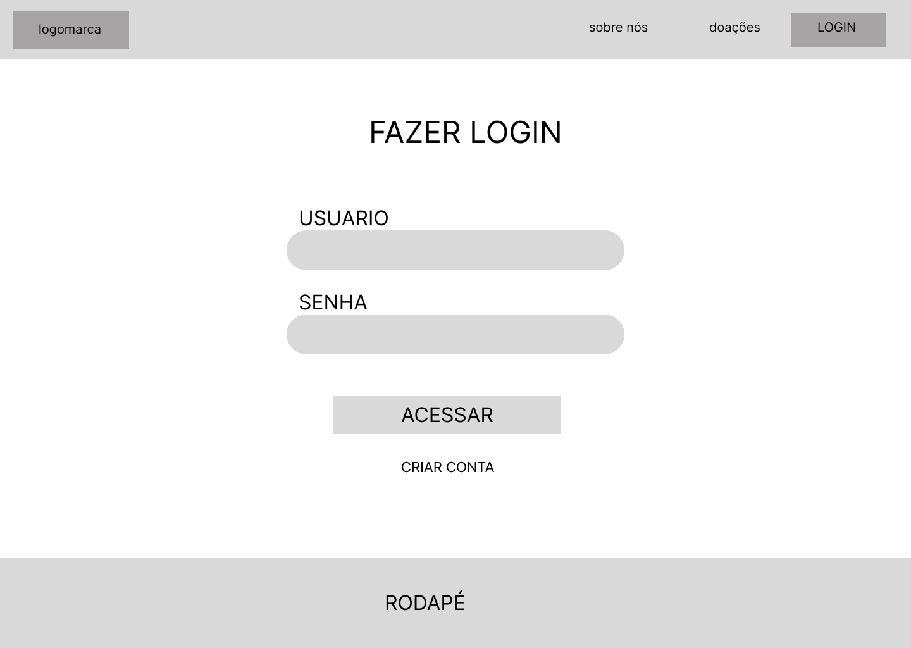
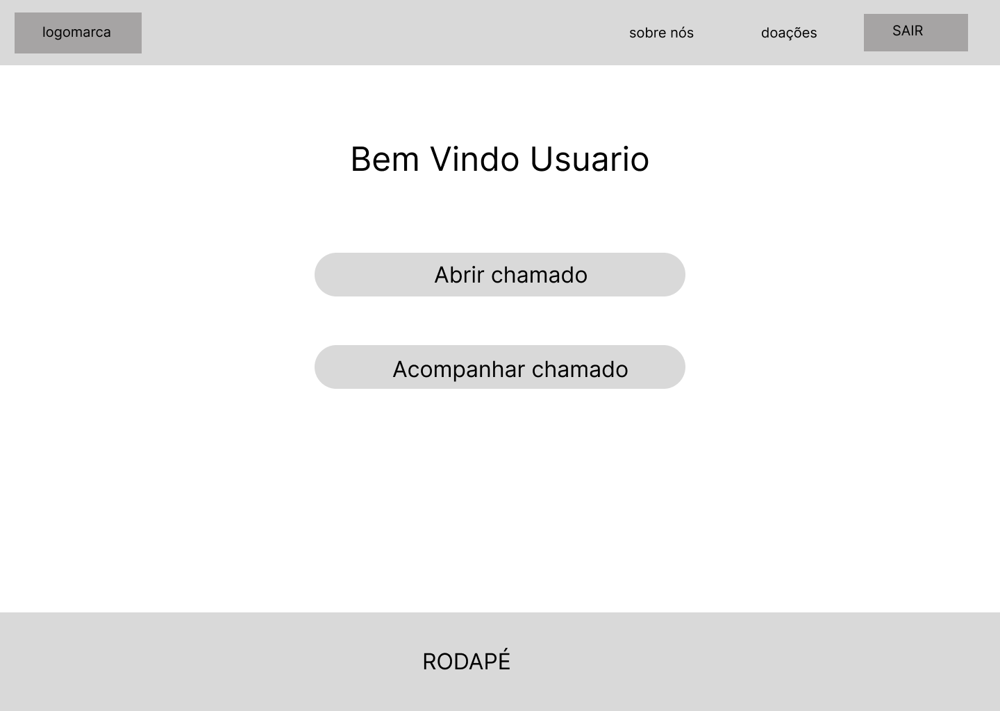
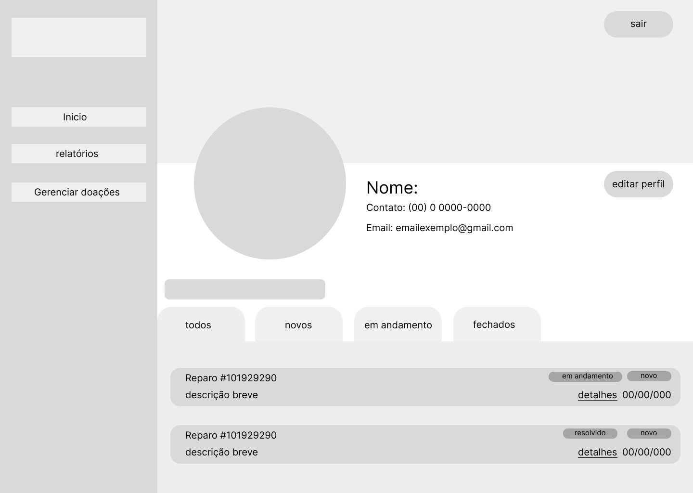
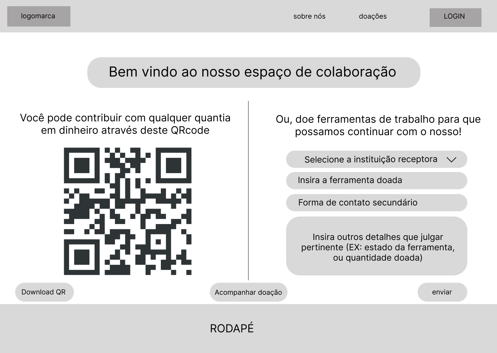
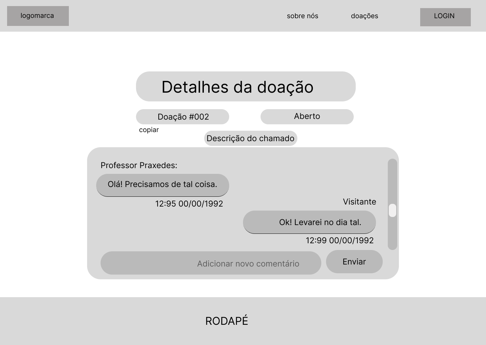
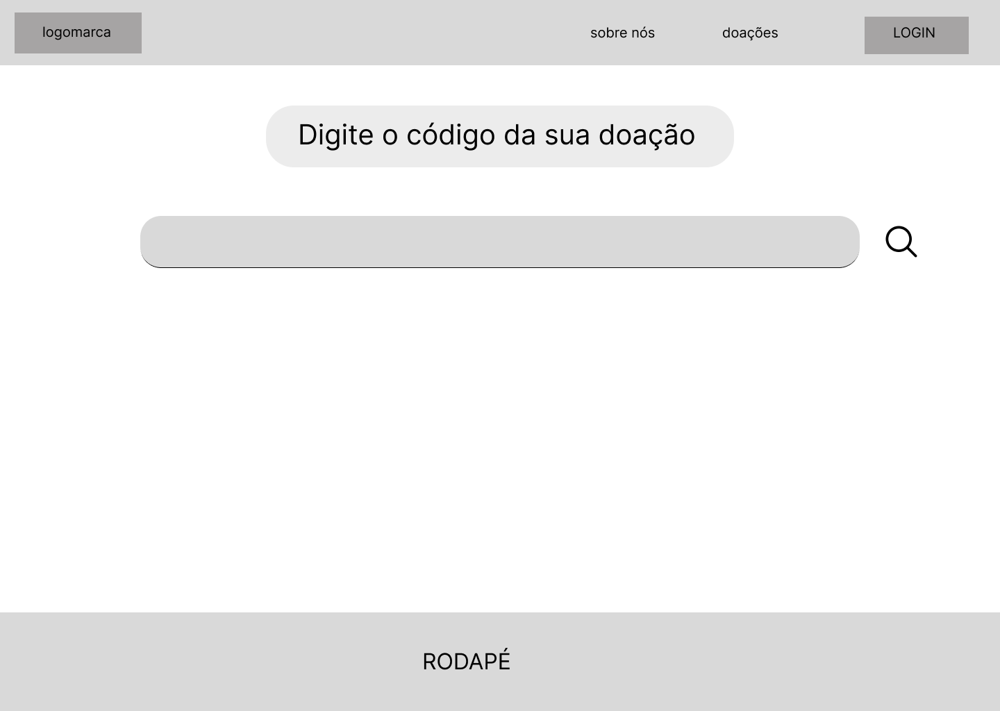
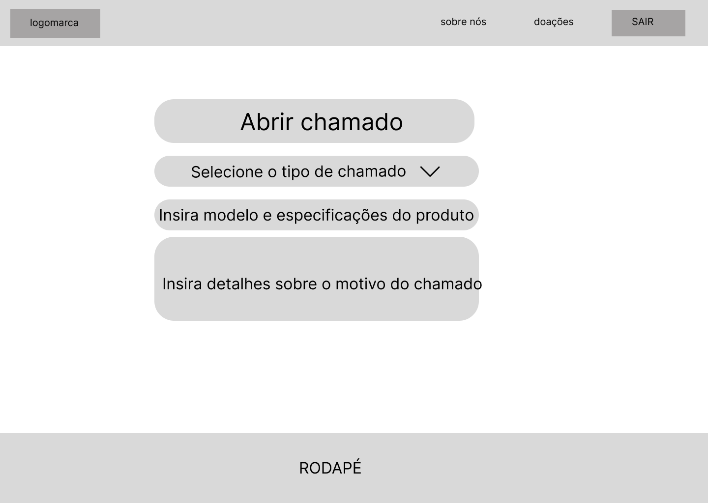
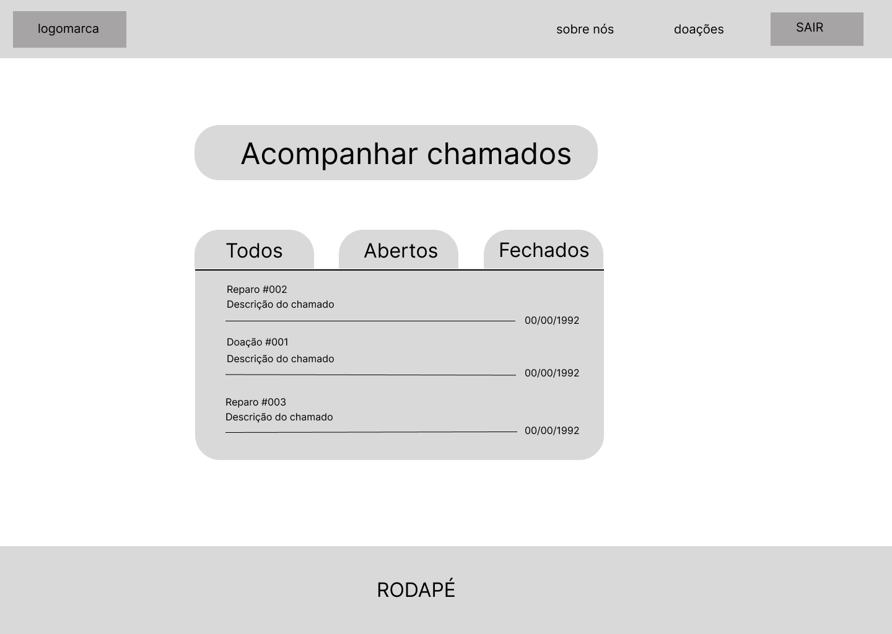
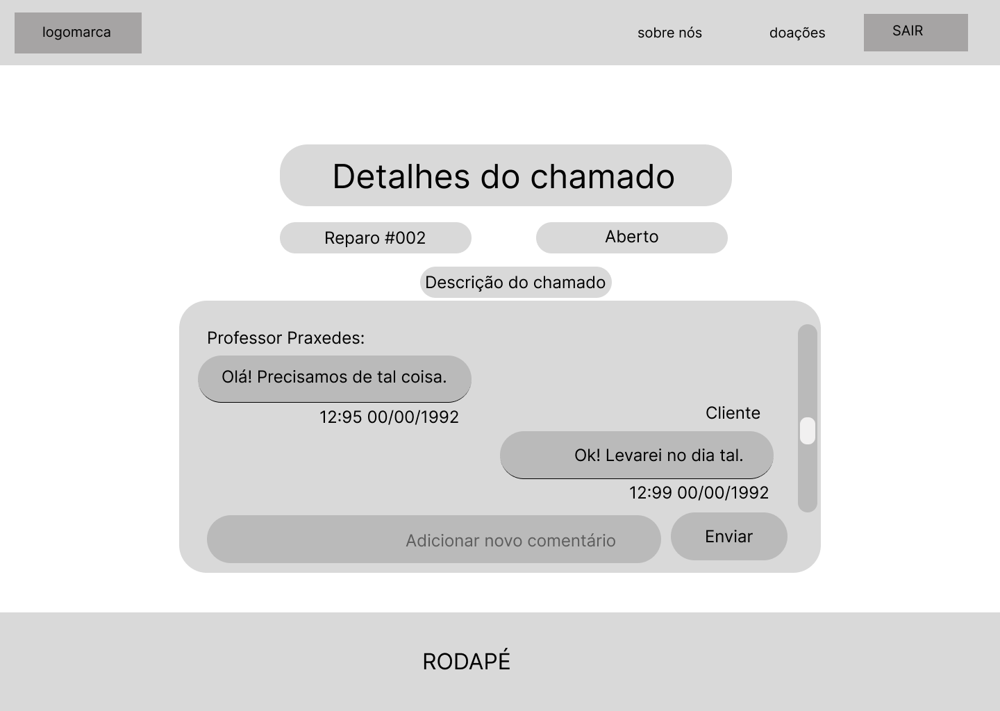

# Protótipos de Interface com o Usuário
## Mapa do Site

## Prototipos de baixa fidelidade

## A. Tela 1: Index

## B. Tela 2: Login

## C. Tela 3: Dashboard Cliente

## D. Tela 4: Dashboard

## E. Tela 5: Doações

## F. Tela 6: Detalhes doações

## G. Tela 7: Acessar doações

## H. Tela 8: Cadastro

## I. Tela 9: Abrir chamado

## J. Tela 10: Acompanhar chamado

## L. Tela 11: Detalhes do chamado

